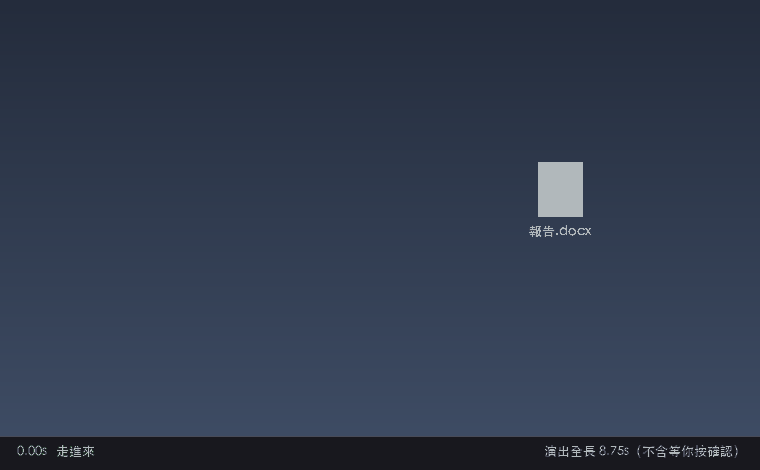

# NiuLaiDeleter(召喚牛來摧毀檔案)

> 基於 [monster_deleter_electron](https://github.com/Alan2Z/monster_deleter_electron)(MIT)開發。
> 牛來角色素材、演出參數、品牌與形象網站為本專案原創。

右鍵檔案/資料夾 → 召喚牛來 → 小牛走進來確認 → 一腳踹飛 → 目標進回收站。一款充滿惡趣味的"檔案刪除助手"。



> 整段演出 8.75 秒（不含你按確認的時間）。檔案在踹的第 5 幀、爆炸的同一刻進資源回收筒——
> 之後的登場與飛離是謝幕。上圖由 `tools/preview_show.py` 直接讀 `config.jsonc` 算出，
> 所以時間與實際程式一致。

## 🐮 內建角色:牛來

內建角色是一隻《牛來》風格的小牛犢(`assets/niulai/`)。

- **素材是程式化繪製的**:6 張 spritesheet(走路/指點/踢踹/爆炸/登場/飛離)、
  瞄準背景圖與應用圖示,全部由 `tools/gen_niulai.py` 用 Pillow 畫出來,
  **不含影片截圖或任何影片素材**——只是照著那隻小牛的造型特徵
  (琥珀黃毛、深棕彎角、粉白大鼻頭、厚八字眉)重新畫的同人素材。
- **規格**:角色幀 225×400、5 列 × 3 行共 15 幀;爆炸幀 480×640。
- **想改造型**:調 `tools/gen_niulai.py` 裡的配色常量與各動畫的關鍵幀參數,
  然後 `python3 tools/gen_niulai.py assets/niulai` 重新生成(只依賴 Pillow)。
- **想加角色**:一個資料夾 = 一個角色,丟六張同規格的 spritesheet 進 `assets/` 即可;
  只放一個 `config.jsonc` 調色的話,素材會自動回退到牛來。
  詳見 [自定義角色操作手冊](assets/自定義角色操作手冊.md)。
- **想重畫預覽 GIF**:`python3 tools/preview_show.py`,時間與座標都直接讀 `config.jsonc`。

> 素材為個人娛樂用途的同人二創,與《牛來》片方無關。

## 📥 下載與安裝(Windows)

**官方網站**:https://niulai-site-production-28c7.up.railway.app

**下載頁**:[Releases](https://github.com/ivan9527945/NiuLaiDeleter/releases/latest)

| 檔案 | 誰該下載 |
|---|---|
| `NiuLaiDeleter-Setup-x64.exe` | 一般 Windows PC(Intel／AMD)**← 絕大多數人** |
| `NiuLaiDeleter-Setup-arm64.exe` | Windows on ARM(Snapdragon X、Surface Pro 11 等) |

不確定自己是哪一種:設定 → 系統 → 系統資訊 → 看「系統類型」。

### 安裝步驟

1. **下載**對應架構的 `.exe`
2. **過 SmartScreen** — 安裝檔未經數位簽章,Windows 會跳出藍色的「Windows 已保護您的電腦」,
   而且預設只有「不要執行」一顆按鈕。請點左下角的「**其他資訊**」→「**仍要執行**」
3. **跑安裝精靈** — 可自選安裝目錄,會建立桌面與開始選單捷徑「召喚牛來摧毀檔案」。
   **不需要系統管理員權限**(每使用者安裝,登錄檔只寫 HKCU)
4. **先啟動一次**(這步不能跳過)— 右鍵選單是在程式啟動時才寫進登錄檔的,
   沒跑過就不會出現右鍵選單。雙擊桌面捷徑會開啟角色選擇視窗
5. **在角色視窗選一次角色** — 右鍵選單的文字跟著預設角色跑,選過才會定下來
6. **開始用** — 對任何檔案或資料夾按右鍵 → 「**召喚牛來摧毀**」

### 解除安裝

設定 → 應用程式 → 找「召喚牛來摧毀檔案」,或到安裝目錄執行 `Uninstall` 開頭的檔案。
解除安裝會自動清掉右鍵選單的登錄檔機碼;`%APPDATA%\niulai-deleter\` 裡的自訂角色素材會保留。

## ✨ 功能

- **右鍵召喚**:在任意檔案或資料夾上右鍵 → "召喚××怪獸摧毀" → 怪獸演出開始
- **摧毀資料夾**:檔案與資料夾都支援右鍵召喚摧毀
- **自動定位**:自動鎖定檔案圖示在螢幕上的位置,怪獸直奔真正的檔案(不需要手動瞄準點選)
- **完整演出流程**:走路入場 → 指點確認 → 對話氣泡 → 踢踹 → 爆炸 → 回收站刪除(檔案/資料夾均可)→ 雷歐登場 → 飛離退場
- **多角色系統**:一個資料夾 = 一個角色,素材自動掃描、配置深合併、缺素材自動回退
- **染色變體**:不換圖,靠染色做出"新怪獸"
- **內建配置編輯器**:右鍵角色卡片 → 高亮編輯 config.jsonc(語法校驗、儲存即生效)
- **動畫參數可調**:入場時長、爆炸觸發幀、飛離時長等全部參數化
- **角色分發**:角色資料夾自包含,壓縮成 zip 即可分發給其他使用者
- **NSIS 安裝版**:桌面捷徑、解除安裝自動清理登錄檔、使用者素材不隨解除安裝丟失

## 🛠 技術棧

| 技術 | 用途 |
|---|---|
| [Electron](https://www.electronjs.org/) 43 | 應用框架(主程序 + 渲染程序) |
| 原生 HTML/CSS/JS | 介面與演出(無前端框架,canvas 逐幀動畫) |
| [CodeMirror 5](https://codemirror.net/) | 配置編輯器(JSON 高亮 + Monokai 主題) |
| C#(.NET Framework 4.x) | 預編譯的"檔案圖示定位"工具(列舉資源管理器列表檢視,~10KB) |
| Win32 API + UI Automation | 跨程序讀取資源管理器/桌面的檔案列表,鎖定檔案圖示座標 |
| electron-builder + NSIS | 打包安裝版(精靈安裝、桌面捷徑、解除安裝清理) |
| JSONC 配置 | 自研註釋剝離器,讓配置檔案可以帶中文註釋 |
| 映象源 | 全程支援 npmmirror 國產映象(見 `.npmrc`) |

## ⚖️ 規格與取捨

| 項目 | 數值 |
|---|---|
| 安裝包體積 | x64 約 103MB／arm64 約 99MB |
| 常駐記憶體 | 約 150MB |
| 冷啟動 | 約 1 秒 |
| 執行環境 | 安裝版開箱即用,不需另外安裝執行時 |
| 權限 | 免系統管理員(登錄檔只寫 HKCU) |
| 演出全長 | 8.75 秒(不含你按確認的時間);檔案在第 3.6 秒進資源回收筒 |

用 Electron 的代價是安裝包與記憶體都比原生 GUI 框架大,換來的是不必處理
使用者機器上的 Python/Qt 執行環境問題,以及渲染層可以直接用 canvas 做逐幀動畫。

## 🎯 自動定位的已知侷限

"自動定位"依賴預編譯的 C# 工具(UIA + Win32 遠端記憶體)列舉資源管理器/桌面的檔案列表,
按檔名匹配後返回圖示座標。已做大量相容(per-monitor DPI 感知、UIA 座標空間自校準、
UTF-8/UTF-16/GBK 三編碼解碼、三通道檢索 + 全域性 UIA 兜底),但以下場景仍可能出現
**定位不準或定位失敗**:

| 場景 | 現象 | 原因 |
|---|---|---|
| 不同解析度 / 不同縮放倍數(DPI) | 怪獸指向位置偏離檔案圖示 | 座標換算依賴螢幕縮放,個別顯示器/顯示卡驅動下 UIA 返回的座標空間與物理像素不一致,啟發式校準仍有誤差 |
| 不同系統預設編碼(UTF-8 / UTF-16 / GBK) | 找不到檔案 → 定位失敗,退回手動瞄準 | 桌面檢視的列表文字按系統 ANSI 內碼表寫入(中文系統=GBK),已嘗試三種解碼,個別改過區域設定/語言包的系統仍會亂碼導致匹配不上 |
| 安裝桌面整理軟體(騰訊桌面整理等) | 桌面上的檔案定位偏差或失敗 | 這類軟體接管了桌面圖示,標準列表檢視/UIA 樹結構被改寫,讀到的座標與真實圖示位置對不上 |

**兜底機制**:定位失敗不會瞎猜游標位置(游標停在右鍵選單上,必然瞄歪),而是自動切換
手動瞄準模式——十字準星 + 滑鼠點選目標,功能完全可用。

**其他已知/未知問題**不再繼續修復。本專案定位已盡力相容,但想做到所有電腦、所有環境
下自動定位都精確,投入產出比太低。有能力者歡迎 Fork 繼續開發(診斷線索見下)。

**遠端排查線索**:每次召喚都會向 `%APPDATA%\niulai-deleter\find-file-rect.log` 追加一行
診斷日誌(工具 DPI 感知模式、命中通道、座標、退出碼),反饋定位問題時附上該日誌即可定位。

## 🚀 快速開始

```bash
npm install          # 安裝依賴(已配置 npmmirror 映象)
npm start            # 開發模式執行
npm run dist         # 打包 NSIS 安裝版(x64 + arm64)→ dist/
```

分發物是兩個安裝檔:`dist/NiuLaiDeleter-Setup-x64.exe` 與 `dist/NiuLaiDeleter-Setup-arm64.exe`。

> 打包指令必須明確帶架構(`--win --x64 --arm64`)。CLI 的 target 參數會覆蓋
> `electron-builder.yml` 的 `win.target` 區塊,而未指定架構時會跟著建置主機走 ——
> 在 Apple Silicon 的 Mac 上打包只會產出 Windows ARM64 版,x64 使用者裝不了。

## 📁 目錄結構

```
src/                 # 原始碼(主程序/渲染程序/角色系統/定位工具)
assets/              # 內建素材模板(首啟複製到使用者目錄)
build/               # 打包構件(NSIS 指令碼 + 定位工具 exe)
public/logo.png      # 應用圖示
assets/自定義角色操作手冊.txt / .md   # 使用者手冊(雙格式)
```

使用者自定義角色的素材目錄:安裝後 `%APPDATA%\niulai-deleter\assets`(點軟體內"📖 自定義角色"直達)。

## 📄 許可證

[MIT](LICENSE)

> ⚠️ 本專案僅用於娛樂和學習使用,禁止用於違法用途。
